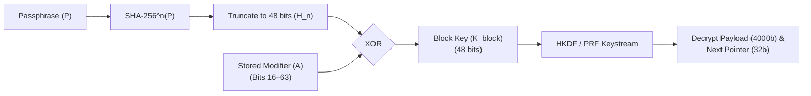

# Architectural Master Outline: Bit-Addressable Deniable Storage & Volatile OS

This document details the low-level bit specifications, mathematical models, and architectural pipeline for the **Milla** operating and deniable storage engine built on top of the **pos** bit-addressable shared-memory simulation bus.

---

## 1. Foundational Architecture & Design Philosophy

Milla is designed from first principles as an offline, metadata-minimized storage and volatile operating system. It operates directly on the flat, bit-addressable memory bus provided by `posetem.pos.POS`.

### Core Axioms
1. **Zero On-Disk Metadata & Verification Oracles**: The raw storage container contains no file-system magic bytes, partition headers, timestamp maps, cleartext free-space tables, or persistent password-verification tokens (such as password hashes, salt headers, or AEAD authentication tags in fixed locations).
2. **Computational Indistinguishability from Chaff**: Every block across the entire volume—whether allocated to active files, directories, or unallocated free space—is formatted identically as a 4096-bit pseudorandom structure.
3. **100% Volatile Reconstruction**: Plaintext file systems, extent graphs, directory hierarchies, and active encryption keys exist strictly in volatile RAM and are completely zeroized upon unmount.
4. **Bounded Random-Mapping Traversal**: Invalid passphrases deterministically traverse uniform random mappings across the physical chunk space, bounded by cycle detection ($\mathbb{E}[T_{\text{cycle}}] \approx \sqrt{\pi b / 2}$) rather than leaking out-of-bounds pointer errors.

---

## 2. Parameterized Chunk Bit Layout

Storage capacity is partitioned into fixed **4096-bit (512-byte)** logical chunks. Each chunk is strictly structured at the bit level to preserve complete structural uniformity between active ciphertexts and synthetic chaff:

```
+------------------+-----------------------+------------------------------------------+------------------------+
|   Bits 0 – 15    |     Bits 16 – 63      |               Bits 64 – 4063             |     Bits 4064 – 4095   |
|     (16 bits)    |       (48 bits)       |                (4000 bits)               |        (32 bits)       |
+------------------+-----------------------+------------------------------------------+------------------------+
| Hash Depth (n)   | Modifier / Salt (A)   | Encrypted Payload Extent                 | Next-Chunk Pointer     |
+------------------+-----------------------+------------------------------------------+------------------------+
```

### Detailed Field Definitions

| Bit Range | Field Size | Encoding | Purpose & Semantics |
| :--- | :--- | :--- | :--- |
| **`0 – 15`** | 16 bits | Big-endian unsigned int ($1 \le n \le 65535$) | **Hash Iteration Depth ($n$)**: Number of hash rounds applied to the master passphrase during per-block key derivation. |
| **`16 – 63`** | 48 bits | 48-bit bitmask | **Pseudo-key Modifier / Salt ($A$)**: Reversible modifier used to reconstruct the block key via $K_{\text{block}} = A \oplus H_n$. |
| **`64 – 4063`** | 4000 bits | Ciphertext stream | **Encrypted Data Payload**: Inodes, directory pointer arrays, or raw file extents. |
| **`4064 – 4095`** | 32 bits | Encrypted 32-bit integer | **Next-Chunk Pointer**: Encrypted terminal pointer with Bit 31 indicating continuation and Bits 0–30 encoding modulo target address. |

### Storage Efficiency
$$\eta = \frac{\text{Payload Bits}}{\text{Total Chunk Bits}} = \frac{4000}{4096} \approx 97.66\%$$

The architecture dedicates $97.66\%$ of the raw media directly to payload storage while embedding all routing, cryptographic salts, and extent chaining internally without external partition tables.

---

## 3. Volume Addressability

The 32-bit pointer architecture ($w=32$) provides expansive addressability while allowing compact memory-mapped operation:

| Pointer Width ($w$) | Chunk Size | Addressable Chunks ($b$) | Maximum Addressable Capacity |
| :---: | :---: | :---: | :---: |
| **16 bits** | 512 B | $2^{16} = 65{,}536$ | 32 MiB |
| **32 bits (Default)** | **512 B** | $\mathbf{2^{32} = 4{,}294{,}967{,}296}$ | **2 TiB** |
| **64 bits (Extended)** | 512 B | $2^{64} \approx 1.84 \times 10^{19}$ | 8 ZiB ($8{,}192$ EiB) |

---

## 4. Cryptographic Pipeline & Key Schedule



### 1. Block Encoding (Writing Data)
1. Sample a random 48-bit **Block Key** $K_{\text{block}} \in \{0, 1\}^{48}$.
2. Sample a random iteration depth $n \in [1, 65535]$.
3. Compute the $n$-th hash of passphrase $P$:
   $$H_n = \text{Truncate}_{48}(\text{Hash}^n(P))$$
4. Compute the stored modifier $A$:
   $$A = K_{\text{block}} \oplus H_n$$
5. Expand $K_{\text{block}}$ through a cryptographically secure PRF (e.g. HKDF-SHA256) to produce a 4032-bit keystream.
6. Encrypt the 4000-bit payload and 32-bit pointer by XORing with the keystream.
7. Write $n$, $A$, ciphertext payload, and ciphertext pointer into the 4096-bit physical slot.

### 2. Block Decoding (Reading Data)
* **Legitimate Passphrase**: Correctly derives $H_n = \text{Truncate}_{48}(\text{Hash}^n(P))$. Recovers the authentic $K_{\text{block}} = A \oplus H_n$, expanding the exact keystream to decrypt valid file content and valid next-chunk routing.
* **Invalid Passphrase**: Computes an incorrect $H'_n \neq H_n$. The XOR operation deterministically yields a pseudo-random garbage key $K' = A \oplus H'_n$. The resulting decrypted payload and pointer decode into uniform pseudorandom noise without raising any immediate cryptographic exceptions.

---

## 5. Modulo Pointer Routing & Path Deception Mechanics

In conventional encrypted filesystems, invalid decryption keys produce out-of-bounds pointer offsets that immediately signal decryption failure to an automated brute-force attacker.

Milla neutralizes this verification oracle through **Modulo Pointer Mapping**:
$$\text{Target Chunk} = a \pmod b$$
* **$a$**: The raw decrypted integer parsed from the lower 31 bits of the terminal pointer field ($0 \le a < 2^{31}$).
* **$b$**: The total number of addressable chunks in the `.pos` user memory volume ($b = \lfloor \text{user\_memory\_size} / 4096 \rfloor$).

### Pointer Structure (32 bits)
```
+---------------+-----------------------------------------------+
|    Bit 31     |                 Bits 0 – 30                   |
|    (1 bit)    |                  (31 bits)                    |
+---------------+-----------------------------------------------+
| Chaining Flag | Modulo Value: raw = target_chunk + (k * b)     |
+---------------+-----------------------------------------------+
```
* **Bit 31 (`is_chained`)**:
  * `1` = Active link; extent continues at `target_chunk`.
  * `0` = Terminal link (EOF or single-chunk file).
* **Bits 0–30 (`raw`)**: Encodes the target chunk with randomized multiplier jitter $k \ge 0$ such that $\text{raw} = \text{target\_chunk} + k \cdot b < 2^{31}$.

### Security Implication
Every possible 32-bit integer decodes to a valid physical chunk index in $[0, b-1]$. The attacker's script cannot distinguish invalid keys by trapping out-of-range memory faults; instead, it is forced to traverse valid physical chunks until a cycle is formed or volatile structural validation fails.

---

## 6. Mathematical Model of Traversal & Cycle Bounds

Under an incorrect passphrase, pointer resolution behaves as a uniform random mapping on a finite set of $b$ chunks: $f: [0, b-1] \to [0, b-1]$.

### 1. Cycle Formation Bound
The probability that a wrong-key walk of length $\ell$ visits only distinct vertices before encountering its first repeated address follows the birthday collision product:
$$P_{\text{nc}}(\ell \mid b) = \prod_{i=1}^{\ell-1} \left(1 - \frac{i}{b}\right) \approx \exp\left[-\frac{\ell(\ell-1)}{2b}\right]$$

### 2. Expected Traversal Work
The expected number of steps before encountering a cycle conforms to the classical random-mapping square-root law:
$$\mathbb{E}[T_{\text{cycle}}] \approx \sqrt{\frac{\pi b}{2}}$$

| Volume Chunks ($b$) | Volume Capacity | Analytical $\mathbb{E}[T_{\text{cycle}}]$ | Empirical Mean ($N=15{,}000$) | 95% Confidence Interval |
| :---: | :---: | :---: | :---: | :---: |
| **4,096** ($2^{12}$) | 2 MiB | **80.21** | 79.57 | [78.91, 80.24] |
| **16,384** ($2^{14}$) | 8 MiB | **160.42** | 160.26 | [158.92, 161.59] |
| **65,536** ($2^{16}$) | 32 MiB | **320.85** | 319.98 | [317.31, 322.65] |
| **262,144** ($2^{18}$) | 128 MiB | **641.70** | 642.08 | [636.73, 647.43] |

**Key Takeaway**: Wrong-key traversals do not generate infinite loops or exponential search trees; they deterministically terminate via cycle detection in $\approx \sqrt{\pi b / 2}$ steps, allowing the volatile interpreter to enforce strict public work budgets $L_{\text{max}}$.

---

## 7. Threat Model Summary

| Threat Vector | Included / Mitigated | Excluded Operational Limitations |
| :--- | :--- | :--- |
| **Static Container Inspection** | **Fully Mitigated**: Zero magic bytes, uniform entropy, all unallocated sectors populated with CSPRNG chaff. | **Multi-Snapshot Analysis**: Differential delta tracking across successive snapshots requires periodic whole-volume re-randomization. |
| **Password Guessing / Dictionary** | **Mitigated**: No $O(1)$ verification oracle; attacker must execute per-block KDF + random walk. | **Weak Human Passwords**: Traversal multipliers cannot compensate for low-entropy credentials. |
| **Forensic Out-of-Bounds Probing** | **Fully Mitigated**: Modulo mapping renders all pointers valid. | **Live RAM Cold-Boot**: Plaintext directory tree resides in active volatile RAM during mount. |
| **Volume Allocation Mapping** | **Fully Mitigated**: Unused space is formatted with valid synthetic jitter chunks. | **Flash SSD Wear-Leveling**: Hardware FTL remanence outside emulator control. |